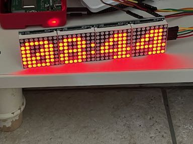

# Raspi Rest

This repository contains code to provide simple REST APIs for things attached to multiple Raspberry Pis. The API is then used from Home Assistant.

The basic idea for the server is to have two threads, and a queue of commands shared between them. One thread accepts incoming requests via flask, and the other communicates with the device(s).

## LED Matrix



If nothing happens, the LED matrix shows the time (can also be turned off entirely). In addition, the LED matrix is set as a notification service from home assistant, using [this integration](https://www.home-assistant.io/integrations/notify.rest/).


To add the LED matrix as a notification target:

```yaml
notify:
  - name: led_matrix
    platform: rest
    resource: http://IPADDRESS:5000/message
    method: POST_JSON
    title_param_name: title
    message_param_name: message
    data:
      "contrast": "{{ data.contrast if (data.contrast is defined) else 255 }}"
      "scroll_delay": "{{ data.scroll_delay if (data.scroll_delay is defined) else 0.06 }}"
      "message": "{{ message }}"
```

To add a switch that can turn on and off showing the time:

```yaml
switch:
  - platform: rest
    resource: http://IPADDRESS:5000/state
    method: POST
    unique_id: led_matrix_state
    name: "LED-Matrix-Zustand"
    body_on: >-
      { "state": "time" }
    body_off: >-
      { "state": "off" }
    headers:
      Content-Type: application/json
    is_on_template: >-
      {{ value_json.state == "time" }}

```
